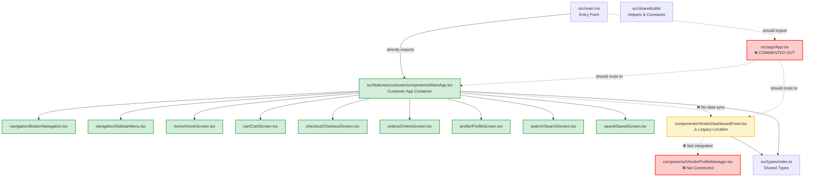
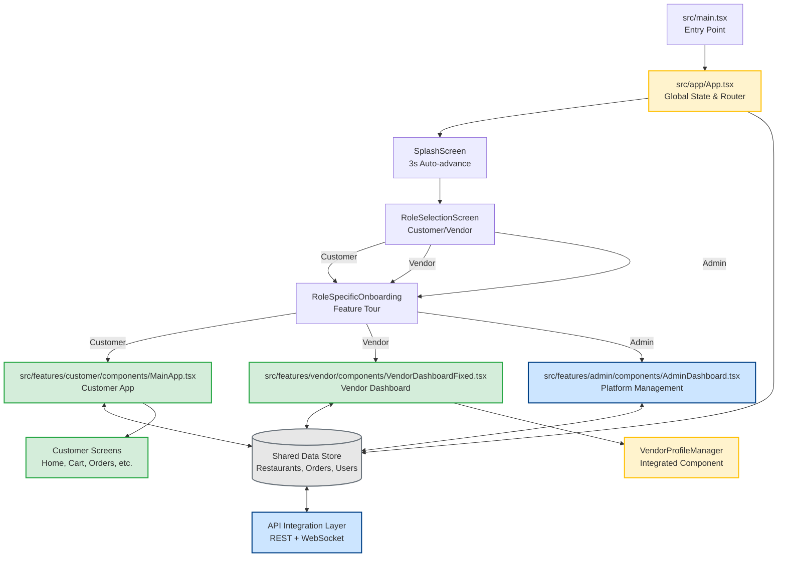

# DeliGo Architecture Diagram

## 🏗️ Complete Codebase Architecture

### Current File Structure & Connections



### Intended Architecture (TO BE IMPLEMENTED)



## 📁 Detailed Component Relationships

### Customer App Components

```
MainApp.tsx
├── State Management
│   ├── currentScreen (navigation state)
│   ├── language (en/rw)
│   ├── user (authentication)
│   ├── cartItems (shopping cart)
│   ├── orders (order history)
│   └── savedItems (favorites)
├── Navigation Components
│   ├── BottomNavigation.tsx (5 tabs)
│   └── SidebarMenu.tsx (full menu)
├── Screen Components (via ScreenRenderer)
│   ├── HomeScreen.tsx
│   ├── SearchScreen.tsx
│   ├── CartScreen.tsx
│   ├── CheckoutScreen.tsx
│   ├── OrdersScreen.tsx
│   ├── OrderTracking.tsx
│   ├── ProfileScreen.tsx
│   └── SavedScreen.tsx
└── Modal Components
    ├── AddedToCartModal.tsx
    ├── EnhancedOrderTrackingModal.tsx
    └── RedesignedAIAssistant.tsx
```

### Vendor Dashboard Components

```
VendorDashboardFixed.tsx
├── State Management
│   ├── activeTab (orders/menu)
│   ├── isOnline (business status)
│   ├── orders (real-time queue)
│   ├── menuItems (inventory)
│   └── analytics (performance)
├── Tab Components
│   ├── Orders Tab
│   │   ├── Order Queue (pending/preparing/ready)
│   │   ├── Order Actions (accept/reject)
│   │   └── Customer Communication
│   ├── Menu Tab
│   │   ├── Menu Items CRUD
│   │   ├── Category Management
│   │   └── Availability Toggle
│   └── Profile Tab (NOT IMPLEMENTED)
│       └── VendorProfileManager.tsx
└── Modal Components
    ├── Order Customizations
    ├── Analytics Dashboard
    └── Settings Modal
```

## 🔄 Data Flow Paths

### Customer Order Flow
```
1. Customer browses restaurants (HomeScreen)
2. Views menu items (VendorProfile → MenuItemCard)
3. Adds to cart (CartScreen)
4. Proceeds to checkout (CheckoutScreen)
5. Places order → Should sync to vendor (BROKEN)
6. Tracks order (OrderTracking)
```

### Vendor Order Management Flow
```
1. Receives new order notification (BROKEN - no sync)
2. Views order in queue (Orders Tab)
3. Accepts/rejects order
4. Updates preparation status
5. Marks as ready → Should notify customer (BROKEN)
6. Completes order
```

### Menu Update Flow
```
1. Vendor updates menu item (Menu Tab)
2. Changes availability/price/details
3. Saves changes → Should sync to customers (BROKEN)
4. Customers see updated menu (BROKEN)
```

## 🔌 Integration Points

### API Integration TODO Locations

**High Priority (Order & Menu Management):**
- `App.tsx:85-95` - Restaurant data fetching
- `App.tsx:97-112` - Order creation and updates
- `App.tsx:114-120` - Menu item updates
- `VendorDashboardFixed.tsx:173-177` - Vendor order queue
- `MainApp.tsx:` - Customer order creation

**Medium Priority (User & Auth):**
- `App.tsx:` - User authentication
- `MainApp.tsx:` - Customer profile updates
- `VendorDashboardFixed.tsx:` - Vendor profile updates

**WebSocket Integration:**
- `App.tsx:122-135` - Real-time subscriptions
- Order status updates
- Menu availability changes
- Restaurant online/offline status

## 📊 Component Statistics

### File Count by Feature Area:
- **Customer Components**: 25+ files
- **Vendor Components**: 6 files (needs consolidation)
- **Shared Components**: 15+ files
- **UI Components**: 20+ files
- **Type Definitions**: 5 files

### Lines of Code (Approximate):
- **MainApp.tsx**: ~600 lines
- **VendorDashboardFixed.tsx**: ~1,900 lines
- **App.tsx**: ~700 lines (commented)
- **Total Customer Code**: ~5,000 lines
- **Total Vendor Code**: ~2,500 lines

### Component Complexity:
- **Most Complex**: VendorDashboardFixed.tsx (all features in one file)
- **Best Structured**: Customer app (properly modularized)
- **Needs Refactoring**: Vendor components (split into modules)

## 🎯 Key Insights

1. **Architecture is 85% complete** - structure exists but connections are broken
2. **Customer app is well-organized** - follows modern React patterns
3. **Vendor dashboard is monolithic** - works but needs modularization
4. **Data flow is completely broken** - no App.tsx coordination
5. **Migration is incomplete** - mix of old and new structures

## 🚀 Next Steps for Architecture

1. **Restore App.tsx** as the central coordinator
2. **Connect data flow** between customer and vendor
3. **Complete vendor migration** to new structure
4. **Modularize vendor dashboard** into smaller components
5. **Implement real-time sync** via WebSocket

This architecture diagram clearly shows the current state of connections and the path to a properly integrated system.